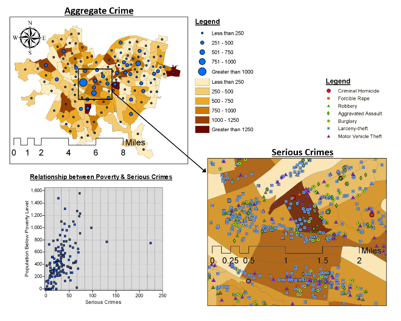

# Adhlere Coffy

There is a LOT going on here.  It looks cool.  But it is also pretty confusing.  It took me a while to figure out what was going on.  There is no overall title for the collection of plots, which could have helped.

In the "Aggregate Crime" map in the top left, there are no labels for what the blue circles or background colors correspond to.  I don't know what is "less than 250" or "greater than 1250."  It's also hard to discern any conclusions from this map.  There is no overwhelming geospatial pattern than I can easily see without a lot of investigation.  The same with the zoomed in "Serious Crimes" map.

The scatter plot in the lower left, is, I THINK, the primary message of this visualization - that there is a relationship between crime and poverty.  If that is true, I think this graph is the most important one and should be more prominent or the only graph.  There are no units on the axes.  

