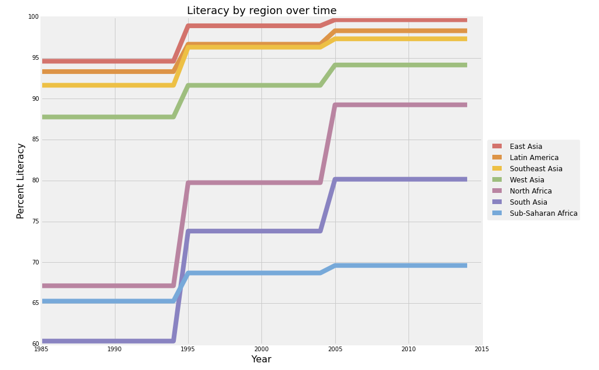

# Erwan LeCun

What is being plotted is clear.  Easy to see changes in each line over time and to compare literacy rates between each line.

It looks as if there are just three years where the data changes, so it might be better to simplify the x axis ticks to see just the relevant years labelled rather than all the years where nothing happens.  Also, given the number of lines, labels rather than a legend  might make it easier to read.

Since the lines don't cross very much, for instance the bottom three never get near the top three, it might be better to change up the order of the colors and not use three similar colors for the top three.