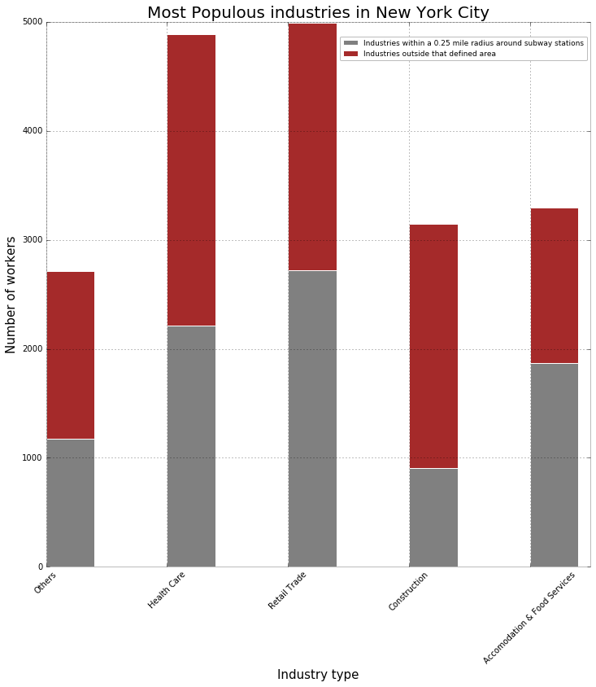

# Manushi Majumdar

The story/message of the visualization is a bit confusing.  I don't know if I'm supposed to be interested in comparing the total number of workers who work in the industries or which industries are more clustered around subway stations.  If I want to know which industries are more likely to be near a subway, then I think the numbers of workers for each industry should be normalized.  As it is, the red bars are difficult to compare becuase they all start and end at different places.

I think the legend text is misleading - it should be something like "number of workers within .25 mile..."  There are no units on the y axis.  

It is ascetically simple and does the job.  The slight transparency of the bars is a nice touch which makes it a bit easier to see where the x ticks cross the bars.